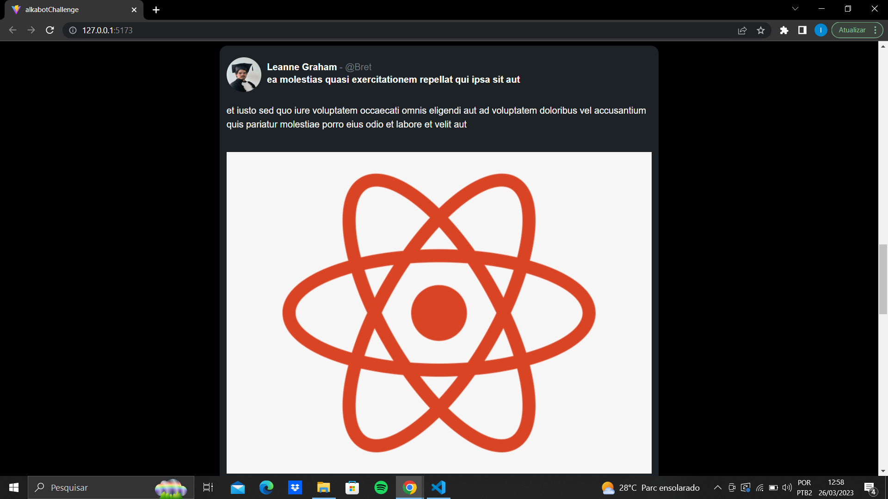
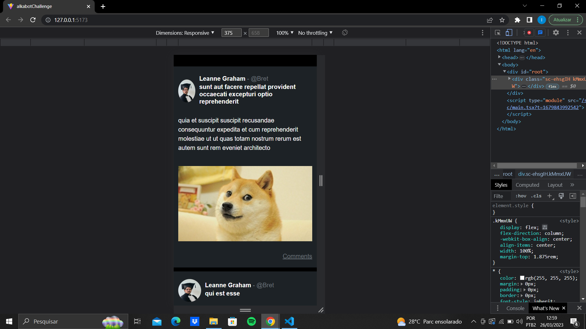
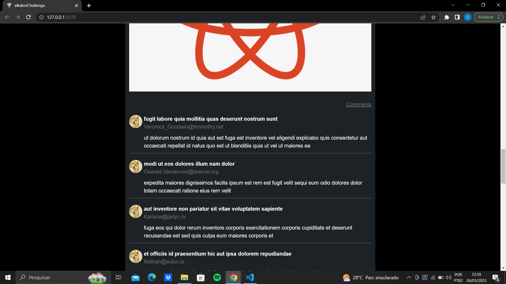

# alkabotChallenge
<div id="top"></div>
<!--
*** Thanks for checking out the Best-README-Template. If you have a suggestion
*** that would make this better, please fork the repo and create a pull request
*** or simply open an issue with the tag "enhancement".
*** Don't forget to give the project a star!
*** Thanks again! Now go create something AMAZING! :D
-->

<!-- PROJECT SHIELDS -->
<!--
*** I'm using markdown "reference style" links for readability.
*** Reference links are enclosed in brackets [ ] instead of parentheses ( ).
*** See the bottom of this document for the declaration of the reference variables
*** for contributors-url, forks-url, etc. This is an optional, concise syntax you may use.
*** https://www.markdownguide.org/basic-syntax/#reference-style-links
-->

<!-- PROJECT LOGO -->
<br />
<div align="center">
  <a href="https://github.com/othneildrew/Best-README-Template">
    
  </a>

  <h3 align="center">Blog posts</h3>

  <p align="center">
    Projeto para processo seletivo
  </p>
</div>

<!-- ABOUT THE PROJECT -->
## Sobre o projeto

Projeto realizado para o desafio técnico solicitado.

<p align="right">(<a href="#top">back to top</a>)</p>

### Construido Com

Aqui estão algumas das ferramentas que utilizei na construção da aplicação:

* [ReactJs](https://legacy.reactjs.org/docs/getting-started.html)
* [Styled Components](https://styled-components.com/)
* [Typescript](https://www.typescriptlang.org/)
* [Vite](https://vitejs.dev/)
* [Git](https://git-scm.com/)

<p align="right">(<a href="#top">back to top</a>)</p>

### Instalação

2. Clone o repositório
   ```sh
   git clone https://github.com/isaniovitor/alkabotChallenge.git
   ```
3. Instale os packages
   ```sh
   npm install
   ```
4. Inicie o projeto
   ```js
   npm run dev
   ```

<p align="right">(<a href="#top">back to top</a>)</p>

<!-- ROADMAP -->
## Funcionalidades

- [x] Posts and comments

  <div align="center">
    
    
    
  </div>

<p align="right">(<a href="#top">back to top</a>)</p>

<!-- CONTRIBUTING -->
## Contribuições

Quaisquer contribuições que você fizer são **muito apreciadas**. Se você tiver uma sugestão para melhorar isso, faça um fork do repositório e crie uma solicitação pull. Você também pode simplesmente abrir um problema com a tag "melhoria".

<p align="right">(<a href="#top">back to top</a>)</p>

<!-- CONTACT -->
## Contact

Linkedin - [Isânio Vitor](inkedin.com/in/isanio-vitor-0b5872209)

Email: [isaniovitor@alu.ufc.br](isaniovitor@alu.ufc.br)

<p align="right">(<a href="#top">back to top</a>)</p>

<!-- MARKDOWN LINKS & IMAGES -->
<!-- https://www.markdownguide.org/basic-syntax/#reference-style-links -->
[contributors-shield]: https://img.shields.io/github/contributors/othneildrew/Best-README-Template.svg?style=for-the-badge
[contributors-url]: https://github.com/othneildrew/Best-README-Template/graphs/contributors
[forks-shield]: https://img.shields.io/github/forks/othneildrew/Best-README-Template.svg?style=for-the-badge
[forks-url]: https://github.com/othneildrew/Best-README-Template/network/members
[stars-shield]: https://img.shields.io/github/stars/othneildrew/Best-README-Template.svg?style=for-the-badge
[stars-url]: https://github.com/othneildrew/Best-README-Template/stargazers
[issues-shield]: https://img.shields.io/github/issues/othneildrew/Best-README-Template.svg?style=for-the-badge
[issues-url]: https://github.com/othneildrew/Best-README-Template/issues
[license-shield]: https://img.shields.io/github/license/othneildrew/Best-README-Template.svg?style=for-the-badge
[license-url]: https://github.com/othneildrew/Best-README-Template/blob/master/LICENSE.txt
[linkedin-shield]: https://img.shields.io/badge/-LinkedIn-black.svg?style=for-the-badge&logo=linkedin&colorB=555
[linkedin-url]: https://linkedin.com/in/othneildrew
[product-screenshot]: src/assets/no_image.jpg
